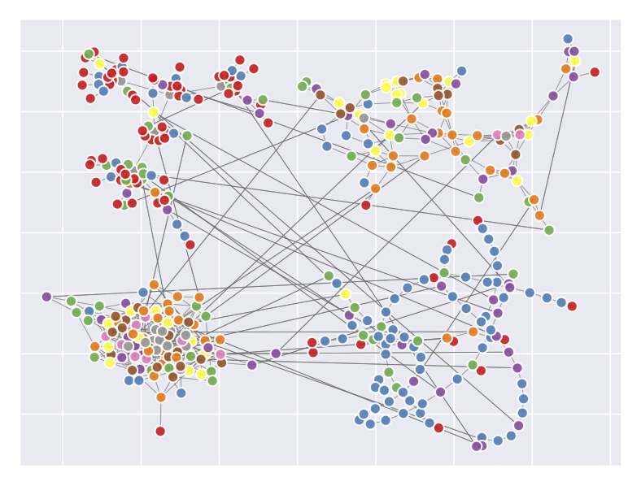

# GraphEnsembleLearning
Representation learning on graphs has been gaining attention due to its wide applicability in predicting missing links, and classifying and recommending nodes. Most embedding methods aim to preserve certain properties of the original graph in the low dimensional space. However, real world graphs have a combination of several properties which are difficult to characterize and capture by a single approach. In this work, we introduce the problem of graph representation ensemble learning and provide a first of its kind framework to aggregate multiple graph embedding methods efficiently. 

``GraphEnsembleLearning`` is a Python package which provides a framework to combine multiple graph embedding approaches for comprehensive graph embedding learning. A paper showcasing the results and analysis using ``GraphEnsembleLearning`` on multi-label node classification task with four real graphs can be found via [Graph Representation Ensemble Learning](https://arxiv.org/abs/1909.02811).

## Implemented Methods
GraphEnsembleLearning consists of the combination of several graph embedding models as following: 
* [Laplacian Eigenmaps](http://yeolab.weebly.com/uploads/2/5/5/0/25509700/belkin_laplacian_2003.pdf)
* [Locally Linear Embedding](http://www.robots.ox.ac.uk/~az/lectures/ml/lle.pdf)
* [Graph Factorization](https://static.googleusercontent.com/media/research.google.com/en//pubs/archive/40839.pdf)
* [Higher-Order Proximity preserved Embedding (HOPE)](http://www.kdd.org/kdd2016/papers/files/rfp0184-ouA.pdf)
* [Structural Deep Network Embedding (SDNE)](http://www.kdd.org/kdd2016/papers/files/rfp0191-wangAemb.pdf)
* [node2vec](http://www.kdd.org/kdd2016/papers/files/rfp0218-groverA.pdf)

## Dependencies
``GraphEnsembleLearning`` is tested to work on Python 3.6

The required dependencies are: Numpy >= 1.12.0, SciPy >= 0.19.0, Networkx >= 2.1, Scikit-learn >= 0.18.1.

To run SDNE, GEM requires Theano >= 0.9.0 and Keras = 2.0.2.

## Install
To use ``GraphEnsembleLearning``, the following package is required to install. 
[GEM-Benchmark](https://github.com/palash1992/GEM-Benchmark) is a Python package which offers a general framework to benchmark graph embedding methods. Please go to its github page for more installation details. To install this library in your home directory, use:
```bash
    git clone https://github.com/palash1992/GEM-Benchmark.git
    pip3 install -r requirements.txt --user
```

To install it for all users on Unix/Linux:
```bash 
    git clone https://github.com/palash1992/GEM-Benchmark.git
    sudo pip3 install -r requirements.txt
```

To install ``GraphEnsembleLearning``, use:
```bash 
    git clone https://github.com/dihuang0220/GraphEnsembleLearning.git
```

## Usage
To genenerate the motivating example graphs and plot graphs. 
```bash
cd Graph_Ensemble
python3 motivation.py
```
<p align="center">
  
</p>

To run Graph Ensemble Learning on graphs. 
```bash
cd Graph_Ensemble
python3 graph_ensemble.py -exp baseline -data ppi
```

## Cite
